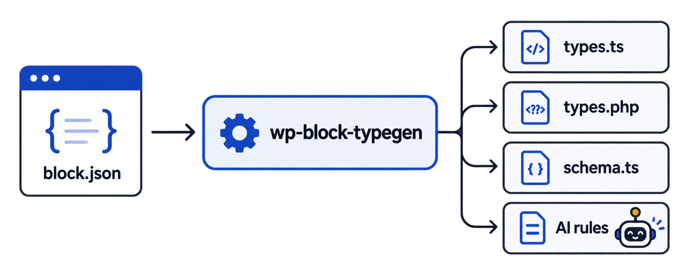
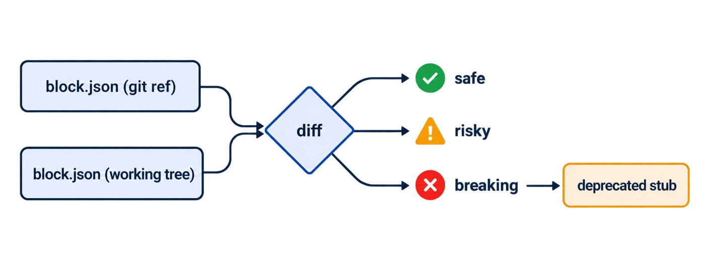

# wp-block-typegen



Zero-dependency TypeScript type generator and Cursor/Copilot AI context builder for WordPress Gutenberg `block.json`.

---

## Why

In enterprise WordPress engineering, `block.json` is the source of truth for block attributes, enums, defaults, and context. However, TypeScript implementations in `edit.tsx` and `save.tsx` suffer from two persistent problems:

1. **Type Drift:** Developers either use `any` or write manual interface definitions in `types.ts` that drift out of sync whenever `block.json` updates.
2. **AI Hallucinations:** When using AI assistants (Cursor, GitHub Copilot, Claude Code), the model frequently hallucinates invalid attribute names, wrong enum literals, or un-typed props because no explicit type definitions exist.

`wp-block-typegen` scans your block directory, validates each `block.json` against WordPress core standards, and automatically generates:
- Strongly-typed `BlockAttributes` interfaces with `@default` JSDocs.
- Typed `setAttributes(attributes: Partial<BlockAttributes>)` updater functions.
- Ready-to-use `BlockEditProps` and `BlockSaveProps` helper interfaces.
- Optional `.cursor/rules/gutenberg-blocks.mdc` context rules to eliminate AI hallucinations.

---

## Architecture

```
               ┌───────────────┐
               │  block.json   │
               └───────┬───────┘
                       │
             ┌─────────▼─────────┐
             │ wp-block-typegen  │
             │   (Zero Deps)     │
             └────┬────────────┬─┘
                  │            │
       TypeScript │            │ AI Context
                  ▼            ▼
          ┌──────────────┐   ┌───────────────────────────┐
          │   types.ts   │   │ .cursor/rules/            │
          │  Attributes  │   │ gutenberg-blocks.mdc      │
          │  EditProps   │   │ (Zero-hallucination spec) │
          │  SaveProps   │   └───────────────────────────┘
          └──────────────┘
```

---

## Installation

### From GitHub (not yet on npm)
```bash
bun add -d github:nadimtuhin/wp-block-typegen
```

### From npm (once published)
```bash
npm install -D wp-block-typegen
# or
pnpm add -D wp-block-typegen
# or
bun add -d wp-block-typegen
```

### Run directly with npx / bunx
```bash
npx wp-block-typegen src/blocks
```

---

## Usage

### 1. Colocated mode (default)
Generates a `types.ts` file alongside every detected `block.json`:
```bash
wp-block-typegen src/blocks
```

### 2. Combined file mode
Aggregates all block interfaces into a single centralized definitions file:
```bash
wp-block-typegen src/blocks --out src/types/blocks.ts
```

### 3. Generate Cursor & Copilot AI rules
Exports exact attribute schemas and coding guardrails into `.cursor/rules/gutenberg-blocks.mdc`:
```bash
wp-block-typegen src/blocks --cursor
```

### 4. CI Validation Gate
Validates all `block.json` files for syntax, schema, and WCAG accessibility standards (missing `alt` tags on media objects) without modifying files:
```bash
wp-block-typegen --check
```

### 5. Watch Mode
Watches for changes to `block.json` files during local development:
```bash
wp-block-typegen --watch
```

---

## Example

### Input: `src/blocks/card/block.json`
```json
{
  "$schema": "https://schemas.wp.org/trunk/block.json",
  "apiVersion": 3,
  "name": "agency/card",
  "title": "Card",
  "attributes": {
    "title": { "type": "string", "default": "Headline" },
    "variant": { "type": "string", "enum": ["simple", "featured"] },
    "media": {
      "type": "object",
      "properties": {
        "id": { "type": "number" },
        "url": { "type": "string" },
        "alt": { "type": "string" }
      }
    }
  }
}
```

### Generated Output: `src/blocks/card/types.ts`
```typescript
/**
 * Auto-generated by wp-block-typegen
 * Block: agency/card
 * Title: Card
 */

export interface CardAttributes {
  /** @default "Headline" */
  title: string;
  variant?: "simple" | "featured";
  media?: {
    id?: number;
    url?: string;
    alt?: string;
  };
}

export type CardSetAttributes = (attributes: Partial<CardAttributes>) => void;

export interface CardEditProps {
  attributes: CardAttributes;
  setAttributes: CardSetAttributes;
  isSelected?: boolean;
  clientId?: string;
  context?: Record<string, unknown>;
}

export interface CardSaveProps {
  attributes: CardAttributes;
}
```

### Usage in `edit.tsx`
```tsx
import { useBlockProps } from "@wordpress/block-editor";
import type { CardEditProps } from "./types";

export default function Edit({ attributes, setAttributes }: CardEditProps) {
  const blockProps = useBlockProps();

  return (
    <div {...blockProps}>
      <h2>{attributes.title}</h2>
      {/* Strict autocomplete: attributes.variant only allows "simple" | "featured" */}
    </div>
  );
}
```

---

## Tested on real blocks

Run against 138 `block.json` files: all 116 WordPress core blocks (`packages/block-library`) and the block.json files in 10up `block-components`, `convert-to-blocks`, `block-catalog`, `retro-winamp-block` and `maps-block-apple`. Result: 138/138 validate, and the generated `types.ts` and `schema.ts` compile under `tsc --strict`. Doctor grades: 116 A+, 10 A, 12 B, none below B. `types.php` passes `php -l` but has not been run through PHPStan.

## Doctor, breaking-change guard, PHP and zod

### `--doctor` / `--roast`: score every block
```
┌─ demo/messy-hero
│  ███████░░░░░░░░░░░░░  33/100  grade F
│  Call the block police.
│  ✖ attributes.count: "count" says "number" but defaults to "three". Bold.
│  ✖ attributes.variant: Default isn't in its own enum. Not even the block trusts the block.
└─
```
`--doctor` prints plain messages, `--roast` prints the same findings with attitude. Exit code 1 when any block scores under 70, so it works as a CI gate. Checks: default vs type, default vs enum, `source: html` without selector, camelCase, `apiVersion`, `$schema`, `textdomain`, `supports.html`, god-blocks (>15 attributes).

### `--breaking <git-ref>`: will this change break saved posts?



```bash
wp-block-typegen src/blocks --breaking origin/main
```
Diffs each `block.json` against the version at that ref. Removed attributes, type changes, removed enum values and changed `source`/`selector` are BREAKING (exit 1) and print a ready-to-paste `deprecated` stub with the old attributes. Default changes are RISKY, because defaults are not serialized. New attributes are safe. Nested object property changes are not compared yet.

### `--php`: PHPStan shape for `render.php`
Writes `types.php` with a `@phpstan-type` array shape, so `$attributes` in `render.php` is typed too. Defaulted keys are required (WordPress fills them), the rest are optional.

### `--zod`: runtime validation
Writes `schema.ts` with a zod schema for REST payloads, patterns and migrations. Needs `zod` in your project.

---

## Compatibility

- WordPress 6.0+ (`apiVersion: 2` and `apiVersion: 3`)
- Works with `@wordpress/scripts`, `10up-toolkit`, Vite, and custom Webpack setups
- Runtime: Node.js 18+ and Bun

---

## License

MIT © [Omar Faruque Tuhin (Nadim Tuhin)](https://www.nadimtuhin.com)
